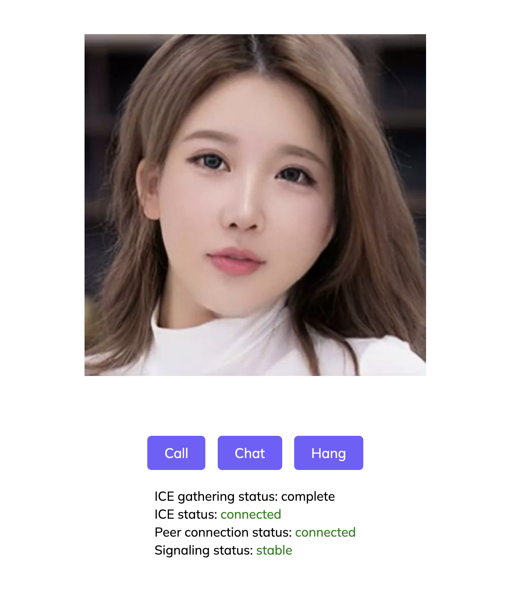

# AI Chat with Anybody
## This is a video chat tool with anybody you want using Chatgpt
## Your only need a photo of the person (your girlfriend, your idol, your friends never met again)
* The app will connect with the AI video chat
* You can talk and the tool will convert your voice to text
* The tool will use chatgpt to mimic your friend and chat with you
* The tool will get the result from chatgpt and use d-id to create the video streaming with your friend's photo
* Your chat history will be stored in memory.json file and the AI will have the memory and answer question smartly
* The voice used is from microsoft voices, I tried some voice clone model to train voice like the friend. But it needs some training data and finetune which I am still working on it for better performance.  

## Initial Setup:
* (install express) open a terminal in the folder and run  - npm install express 
* Register an did account in https://studio.d-id.com/, there will be some trail credit for free.
* (add your did api key) edit the `api.json` inside the uncompressed folder and replace with your key
* (add your chatgpt api key) edit the `api.json` inside the uncompressed folder with your key
* (add your friend's photo) edit source_portrait_url in `api.json` with the photo url, you can upload the photo to did (https://studio.d-id.com/editor)
* There is some other configs in the `api.json`, feel free to update
* 

## Start the app:
* (bring up the app) in the folder (ctr left click on folder through finder) open the terminal run node app.js 
* You should see this message - server started on port localhost:5000
* (open the app) in the browser add localhost:5000
* (connect) press Call you should see the connection ready 
* (stream) press the Chat button to start chatting

## App:
